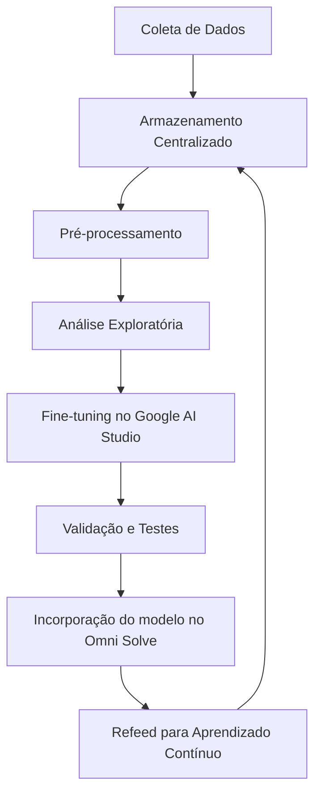

## !! Futuro do Omni Solve !!
Nosso objetivo futuro é utilizar os dados obtidos a partir de um projeto de web scraping concluído com sucesso durante o hackathon, juntamente com dados fornecidos por outras empresas, para realizar o fine-tuning de modelos de IA generativa existentes. Essa integração permitirá:

- **🎯 Contribuição para o Objetivo**: Planejamos contribuir com a empresa para atingir o objetivo proposto por nós, utilizando em conjunto nossa expertise em análise de dados e IA generativa.
- **🔍 Identificação de Padrões**: Através da análise de dados, identificaremos padrões de comportamento que podem prever problemas futuros.
- **💡 Soluções Proativas**: Com as informações em mãos, seremos capazes de sugerir soluções antes que os problemas afetem os clientes.
- **📈 Melhoria Contínua**: A coleta contínua de dados e feedback permitirá um aprimoramento constante da experiência do cliente e da eficiência operacional.

Além disso, estamos desenvolvendo novas funcionalidades para aprimorar ainda mais a solução Omni Solve:

- **📊 Painel Administrativo para a Bemobi**: Uma interface administrativa que permitirá à Bemobi visualizar o status geral das reclamações das empresas parceiras, facilitando a gestão e monitoramento das interações.
- **📝 Tela de Reclamação Individual**: Uma tela detalhada para cada reclamação, incluindo informações adicionais como o horário em que a reclamação foi feita e o tempo total para resolução, proporcionando uma visão mais completa e precisa do atendimento ao cliente.

## Dados de Web Scraping

Já temos um projeto de web scraping funcionando, que coleta dados relevantes para nossa análise. Um exemplo disso é o arquivo `m4u_reclamacoes_completo.csv` obtido durante o hackathon através do webscraping no site do Reclame Aqui, que contém uma amostra de informações detalhadas sobre reclamações coletadas. 

| URL                                                                                     | Título                                                       | Texto                                                                                                                                                                                                                                                                                                                   | Status        | Local                       | Data e Hora              | Tipo de Problema            | Produto               | Categoria                 | Resposta Empresa                                                                                                                                                                                                                                                                                                                                                              | Réplica Usuário                                                |
| --------------------------------------------------------------------------------------- | ------------------------------------------------------------ | ------------------------------------------------------------------------------------------------------------------------------------------------------------------------------------------------------------------------------------------------------------------------------------------------------------------------ | ------------- | -------------------------- | ------------------------ | --------------------------- | ---------------------- | ------------------------- | ------------------------------------------------------------------------------------------------------------------------------------------------------------------------------------------------------------------------------------------------------------------------------------------------------------------------------------------------------------------------------ | -------------------------------------------------------------- |
|
| [Cobrança indevida](https://www.reclameaqui.com.br/m4u/cobranca-indevida_ntvfN_1sOQDPcVJ5/)                             | Cobrança indevida                                             | Existe um boleto de plano controle vinculado ao meu CPF com empresa de CNPJ 09.614.276/000134 sem eu nunca ter feito plano controle. Peço que esse boleto com vencimento de 1 de setembro seja retirado imediatamente do meu nome, senão as ações cabíveis judiciais serão tomadas contra a empresa!                         | Respondida    | Campina Grande - PB         | 09/10/2024 às 15:10      | Provedores e serv. de internet | Internet para celular   | Cobrança indevida         | Prezado(a) cliente, esclarecemos que M4 Produtos e Serviços S.A. é uma prestadora de serviços de processamento de pagamento, não sendo responsável pelo relacionamento direto com o cliente. Identificamos a ativação de um plano Vivo controle, que já foi cancelado, e o boleto também foi retirado. Att., Bemobi.                          | --                                                             |

A utilização desses dados nos permite realizar análises mais precisas e desenvolver soluções mais eficazes para os problemas enfrentados pelos clientes. Futuramente, haverá a utilização desses dados no fine-tuning de APIs existentes, aprimorando ainda mais a capacidade de resposta e a eficiência das soluções oferecidas.

## Fluxo de Coleta de Dados e Ajuste do Modelo

Este fluxograma ilustra o processo de coleta de dados e ajuste do modelo, desde a coleta inicial até a implantação do modelo ajustado, incluindo um loop para refeed de dados, garantindo aprendizado contínuo.

# Introdução

## O que é o Omni Solve?

Omni Solve é uma solução inovadora de suporte ao cliente desenvolvida pela equipe durante o hackathon da Bemobi. Utilizando tecnologia de Inteligência Artificial Generativa (GenAI), o Omni Solve oferece uma experiência abrangente e personalizada para resolver problemas comuns enfrentados pelos clientes em serviços de assinatura. Nossa proposta é otimizar a comunicação e a eficiência no atendimento ao cliente, focando especialmente nas questões relacionadas a pagamentos e gestão de assinaturas.

## Problema

Os clientes frequentemente enfrentam uma série de problemas ao gerenciar suas assinaturas, especialmente no que diz respeito a pagamentos automáticos. Esses problemas podem incluir:

- **🔄 Recargas não confirmadas**: Clientes não conseguem verificar se suas transações foram bem-sucedidas.
- **💳 Cobranças indevidas**: Dificuldades em resolver disputas sobre cobranças que não parecem corretas.
- **⏳ Falta de suporte eficiente**: Respostas lentas e comunicação fragmentada entre as empresas intermediárias e a Bemobi.

Esses desafios não apenas prejudicam a experiência do cliente, mas também impactam a reputação das empresas que utilizam os serviços da Bemobi.

## Proposta de Solução

### Como o Omni Solve Funciona

O Omni Solve utiliza um chatbot inteligente que guia o usuário na identificação e resolução de problemas. A solução é projetada para:

- **🔍 Identificação de Problemas**: O chatbot utiliza Processamento de Linguagem Natural (NLP) para entender as reclamações dos clientes e direcioná-los para a solução apropriada.
- **🔎 Investigação Automática**: O sistema verifica automaticamente os dados de pagamento e transações no banco de dados da Bemobi, identificando inconsistências.
- **🎫 Geração de Tickets**: Se o problema requer intervenção de uma empresa intermediária, o sistema gera automaticamente um ticket com as informações necessárias, acelerando o processo de resolução.
- **📚 Feedback e Aprendizado**: A cada nova reclamação, o Omni Solve aprende e se adapta, utilizando dados históricos para melhorar continuamente suas respostas e soluções.

## Benefícios

### Para a Bemobi

- **⚙️ Eficiência Operacional**: Redução do tempo necessário para resolver problemas de pagamentos e aumentar a satisfação do cliente.
- **📊 Relatórios de Desempenho**: Geração de relatórios que ajudam a identificar padrões de problemas, permitindo melhorias estratégicas nas operações.
- **🔗 Integração com Dados de Terceiros**: A capacidade de conectar dados de diferentes fontes para uma análise mais abrangente.

### Para as Empresas Parceiras

- **📞 Melhor Comunicação**: Conexão direta entre as reclamações dos clientes e as soluções oferecidas, garantindo que os problemas sejam tratados rapidamente.
- **🔒 Retenção de Clientes**: Aumentar a satisfação do cliente ajuda a reduzir a taxa de cancelamento de assinaturas, beneficiando todas as partes envolvidas.

## Conclusão

O Omni Solve representa uma solução poderosa e inovadora para os desafios enfrentados por clientes e empresas de serviços de assinatura. Com a utilização de GenAI, esperamos transformar a experiência de atendimento ao cliente, aumentando a satisfação e eficiência em toda a cadeia de serviços. Estamos empolgados com o futuro e comprometidos em trazer melhorias significativas para a Bemobi e seus parceiros.

## Informações de Contato

Para mais informações sobre a solução do hackathon Omni Solve, entre em contato com os membros da equipe:

- **João Bernardino** - Email: jpbernardinoo@gmail.com
- **Helena Vieira** - Email: vierahln@gmail.com
- **Priscila Anjos** - Email: prianjss@gmail.com
- **Caio Hebert** - Email: caiohebertv@gmail.com
