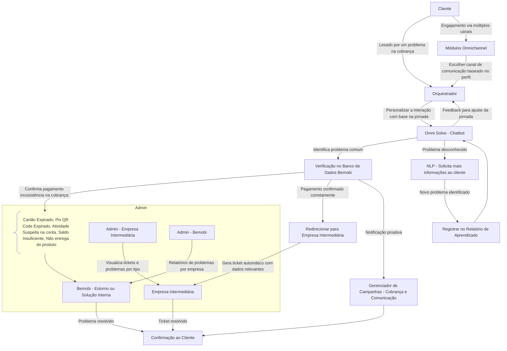

# HACKATHON

---

## TEMA:

> **Desafio: O desafio está centrado nos serviços baseados em assinaturas com pagamentos recorrentes. O objetivo é utilizar tecnologia de Inteligência Artificial (GenAI) para otimizar a experiência do cliente, desde o momento da contratação até o gerenciamento contínuo de contas básicas recorrentes.**
Os times deverão criar soluções inovadoras utilizando GenAI para abordar problemas comuns enfrentados pelos clientes em serviços de assinatura, focando na personalização, simplificação e **otimização da experiência**. **As soluções podem ser aplicadas em qualquer etapa do ciclo de vida do cliente, como onboarding, suporte, gestão de pagamentos, prevenção de falhas ou personalização de ofertas.** Assistente virtual. gerenciamento proativo de assinaturas e recomendações para melhoria de conversão são alguns exemplos de aplicações para a referida proposta.
> 

## BEMOBI - contexto

quem compra - empresas de telefonia etc

quem reclama - clientes das empresas de telefonia

- **Microcrédito e Microseguros:** Oferece serviços financeiros digitais acessíveis, como microcrédito e seguros, especialmente em mercados emergentes.
- Pagamento Mobile ( Carrier Billing ): permite pagamentos de serviços digitais diretamente das contas de telefone, sem a necessidade de cartão de crédito. Ex: cobrança de serviços de streaming e jogos ( netflix, google play e spotify )
- Omni Pay + Omni Engage oferecem formas de pagamento recorrente em outras empresas (operadoras)
- Eles tem os proprios serviços de assinatura - apps club

### **Estatísticas Relevantes**

- Mais de 35 países atendidos.
- Mais de 200 milhões de usuários globais.
- Presença em mais de 70 operadoras de telecomunicação.
- Mais de 100 milhões de downloads em sua plataforma de apps.

### Problemas

1. Segurança dos dados: dado o crescente risco de fraudes e ataques à privacidade (muda bct nenhuma em experiência de usuário)
2. Falha nos pagamentos automáticos: é uma questão muito comum (motivos: cartões expirados, atividades suspeitas que podem indicar possível fraude ou saldo insuficiente)
3. Incapacidade em lidar com os problemas dos clientes de forma rápida e satisfatória.
4. Indiretamente herda reclamações das empresas que fornece suporte ( B2B2C)
5. Gen IA saiu na porrada com o B2B, nos resta pensar em soluções B2C

## Como usariamos GenAI nessa plataforma?

*escolher um problema visível e pesquisar sobre ele*

- Chatbot para resolução de problemas de pagamentos (suporte para problemas)
    - Nome
        - “Omni” do latin “ omnis”, significa "tudo", "todo", ou "em toda parte”
        - 
    - Proposta
        - A GenAI pode ser aplicada para criar **chatbots mais inteligentes** e sistemas de suporte ao cliente automatizados, que possam responder a dúvidas e resolver problemas de maneira mais natural e eficiente. Exemplos incluem:
            - **Resolução automática de problemas**: Chatbots com IA podem guiar os usuários na solução de problemas comuns, como dificuldades em acessar conteúdos ou gerenciar assinaturas, de forma rápida e eficaz.
            - **Assistentes personalizados**: Um assistente virtual com IA pode ajudar o cliente a gerenciar suas assinaturas, sugerir novos pacotes e até mesmo fornecer dicas sobre como tirar o máximo proveito dos serviços da Bemob~gpt
            
    - Obstáculos
        - Como direcionar clientes das diversas empresas filiadas a Bemobi?
            - Aqui no caso seria pensar em como ligar o usuário final com a bemobi com os problemas relacionado a pagamento (e isso só os que eles tem controle). Porque eles n tem acesso aos dados dos usuários, eles tem só registros de transações (e querendo ou n ter esse controle evitaria desgaste com os clientes deles — que são as empresas)
        - Como criar uma experiência de usuário unificada? As empresas suportadas da Bemobi possui UI diferentes… trocar rapidamente de interface não causaria boas impressões ao usuário

- **Geração de Insights a Partir de Dados do Cliente (prevenção de falhas)**
    - Proposta
        - A Bemobi pode usar GenAI para processar e analisar grandes volumes de dados dos clientes (preferências, comportamento de uso, padrões de pagamento) e gerar insights valiosos:
            - **Análise preditiva**: Prever quais clientes estão mais propensos a cancelar assinaturas e sugerir ações de retenção antes que isso ocorra. ( Churn de clientes )
            - **Otimização de conteúdo**: GenAI pode sugerir novos conteúdos ou funcionalidades a serem adicionados aos serviços com base nas tendências de uso e feedback dos clientes, criando ciclos de melhoria contínua.
            - **preços dinâmicos com IA:** [https://ecommerceresult.com/pt/5-maneiras-pelas-quais-a-ia-pode-otimizar-estrategias-de-precos-para-servicos-de-assinatura/](https://ecommerceresult.com/pt/5-maneiras-pelas-quais-a-ia-pode-otimizar-estrategias-de-precos-para-servicos-de-assinatura/)
    - Obstáculos
        - Coleta limitada de dados, assumimos que a Bemobi possua:
            - Dados de uso do serviço (frequência, duração, tipos de conteúdo acessado)
                - sabem se o plano foi renovado
            - Histórico de pagamentos
                - celular, valor, modo de pagamento
            - Interações com suporte ao cliente
            - Dados demográficos (se disponíveis)
            - Feedbacks e avaliações do serviço
        - 
        

## 5w2h

- o que
- quando
- quanto
- como
- por que
- quem
- onde

---

# Produto - Omni Solve ( a decidir )

> “Omni” do latin “ omnis”, significa "tudo", "todo", ou "em toda parte”
> 

Como uma solução abrangente e inteligente para suporte ao cliente, a ferramenta white-label “Omni Solve” destaca a capacidade do chatbot de resolver problemas de maneira eficiente e personalizada, utilizando GenAI para proporcionar uma experiência de atendimento superior.

Os clientes que encontram problemas relacionados a pagamentos enfrentam uma comunicação fragmentada entre a empresa intermediária e a bemobi. Notamos que muitos desses problemas podem ser verificados nos dados da própria Bemobi, que constata o que realmente aconteceu e poderia direcionar para o canal correto para a resolução do problema, seja com a intermediária ou a própria bemobi.

## Problemas comuns

- recargas não confirmadas
- cobranças teoricamente indevidas

## O que o chatbot faz

1. Guia o usuário para identificar o problema
    1. caso seja um problema “novo” que a IA não consiga gerar soluções com base em dados anteriores, ele pode:
        1. pede pro cliente digitar, para que novos problemas que surjam possam ser contabilizados pro relatório e levados pra aprendizagem
            1. **NLP (Processamento de Linguagem Natural)**: A IA pode interpretar as descrições dos problemas feitas pelos clientes, extrair palavras-chave, e assim atribuir a responsabilidade ao intermediário correto.
        2. ele redireciona pro suporte da empresa intermediária
        
2. Pede os dados necessários para investigar no banco de dados
3. retorna com resultado da investigação 
    1. analisa se é um problema a ser resolvido pela empresa intermediária ou a Bemobi (estorno) 
        1. Isso automatiza grande parte do processo, eliminando a necessidade de longas interações entre o cliente e várias empresas.
    2. se for um problema que apenas a empresa intermediária (que contratou a bemobi) pode resolver, o sistema gera um ticket contendo todas as informações relevantes (cliente, problema, histórico de transações), enviando esse ticket automaticamente para a empresa intermediária e para a bemobi para que o problema possa ser resolvido o mais rápido possível.
    3. redireciona para o canal de atendimento humanizado correto.
        1. conectar com os sistemas de suporte da empresa contratada, de forma que o ticket seja enviado para o funcionário correto e o usuário seja redirecionando para essa tela/para o meio de comunicação necessário que a empresa intermediária fornece.

## O que a IA faz por debaixo dos panos

- Aprendizado
    - Monta uma base de dados com as reclamações do reclame aqui e conforme as pessoas forem relatando seus problemas para o chat, onde percebemos que as respostas seguem um padrão e podem ser usadas de base para a investigação
- Investigação
    - verificação de status de transações ou até mesmo solicitações de estorno no banco de dados, economizando tempo para o cliente e para as empresas envolvidas.
        - se é necessário estorno, se o pagamento foi confirmado, se os dados batem com a descrição passada.
    - retorna com o identificador necessário da operação, caso o usuário tenha que ser redirecionado a alguém da empresa
        - ex: na TIM há identificadores de recarga
- Relatórios (isso para os admins)
    - a Omni Solve pode gerar relatórios com os principais problemas relatados por clientes, facilitando melhorias tanto nos sistemas bemobi quanto nos sistemas das empresas contratantes. Assim, fica mais fácil de saber quais operações específicas estão dando erro ou gerando inconsistências

## Telas

### Chatbot

- 

### Admin - empresa intermediária

Aqui seriam armazenados os problemas de pagamento que precisam ser resolvidos com a empresa contratante.

Geraria um dashboard com os principais problems relatados

- poderia separar por tipo de problema, em qual operação ele ocorre

Visão dos problemas chegando (ticket):

- Nome da pessoa
- Dados (número de telefone, valor (?), descrição do problema.

### Admin - bemobi

- pensamentos
    - O que pode ser extraído do chatbot que vai ser útil para o painel de admin
        - Problemas recorrentes
            - Cartões expirados: enviar uma mensagem dizendo que o cartão venceu
                - No painel de admin ele iria olhar as faturas futuras por ex, e ai se o cartão tiver para vencer mandar mensagem para o cliente avisando isso.
            - Atividades suspeitas que podem indicar possível fraude: ????
            - Saldo insuficiente: A IA consegue identificar que o problema de n ter efetuado o pagamento foi saldo insuficiente e notificar o usuário?
            - Possíveis soluções
                - A IA consegue gerar automaticamente uma solução pros problemas acima (pesquisar)
        - 
        - Tem como prever um problema? Ser resolvido antes de chegar a ser um problema que precisa que o cliente reclame para que a bemobi resolva (?)
- visualizações gerais dos problemas:  exibe todas as reclamações mais recentes do *Reclame Aqui* e do chatbot, com filtros por tipo de problema, frequência, empresa envolvida (intermediária)
- visualização por empresa parceira
- visualização por problema (aqui entraria o relatorio de problemas?)
- identificar quais pessoas estão tendendo a ter problemas relacionado a pagamentos.
    - Ex: cartão expirado, pode ter uma parte onde eles conseguem ter esse controle para evitar que venha a ser uma reclamação do cliente.
    - ? uma visualização de como esses avisos estão sendo eficientes ?
- Pode ter algum sistema de alerta onde ele identifica automaticamente padrões em relatos (ex.: falhas de recarga, estorno repetido). Exibe sugestões de ações, como investigar transações específicas ou melhorar integração com determinada empresa. Ex.: Alerta "Problema recorrente detectado: Falha de recarga Vivo (30 relatos nos últimos 7 dias)".

Dashboard:

- Visualização por tipo de problema, por empresa intermediária (a visão de empresa é interessante porque a bemobi pode ver se o problema é com a parte de pagamento daquele serviço especifico, ou o deles no geral)
- indicar se há um problema comum entre as empresas

## Tecnologias

---

# Pitch

### Storytelling
